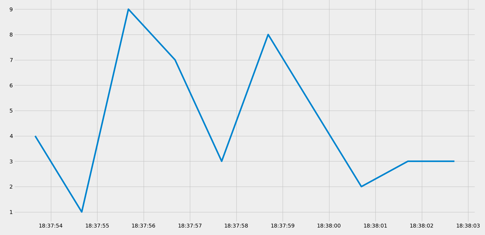
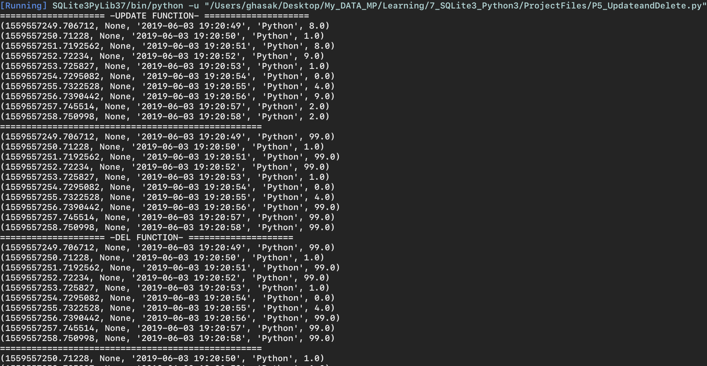

# SQLite3 with Python 3.7
# - Quick References and Formula to increase productivity

Everything you need to know about SQLite is located here.
We will start with the following syllabus. SQLite is a lighter version of SQL, we can create a database without a server.
# To run a script file in this project
Use the following:

```
python ProjectFiles/PX_CreatDataBaseTable.py
where(X) is the number of the file script.
```
* When you call any function, you need to use P5 because the script there is completed and follow the sequence of writing each function with the sequence of writing.

```
create_table()
#read_from_db()
Input_values()
#graph_data()
Update_DataBase()
Del_DataBase()
c.close()
conn.close()
```


# P1- Creating a Database, table and inserting:

We always define the connection and cursor,

```
import sqlite3
import os


ResourceDir = os.getcwd()
# print (ResourceDir)

# Connect a database if its existed:
conn = sqlite3.connect(ResourceDir+'/resources/'+'tutorial.db')
c = conn.cursor()


# Define a new table in the database

def create_table():
    c.execute('CREATE TABLE IF NOT EXISTS stuffToPlot (unix, REAL, Datestamp TEXT, keyword TEXT, value REAL)')


# Define inputing data to your Table in your current open database

def data_entry():
    c.execute("INSERT INTO stuffToPlot VALUES(145123232, 4.454,'2016-01-02', 'python', 5 )")
    conn.commit()
    c.close()
    conn.close()


create_table()
data_entry()
```
* Every time you modify your table you need to commit (**Save**) your table once you modify it.


# P2- Inserting variables to database table (IMPORT)
There are few things that you will need to input your variables in **Hard way** as you saw previously. and here how to make things are more easy for importing data.

```


# Adding here the code of P2-

def dynamic_data_entry():
    unix = time.time()
    date = str(datetime.datetime.fromtimestamp(unix).strftime('%Y-%m-%d %H:%M:%S'))

    keyword = 'Python'
    value = random.randrange(0,10)
    c.execute("INSERT INTO stuffToPlot (unix, datestamp, keyword, value) VALUES (?,?,?,?)",
              (unix, date, keyword,value))
    conn.commit()

create_table()
#data_entry()

for i in range(10):
    dynamic_data_entry()
    time.sleep(1) # just to make our datestamp goes for a second to get a new entry, this just for the tutorial


c.close()
conn.close()
```


## NOTE-1
you can change the order of the table in your SQL, you can level a value empty for a certain cell in your table, but you cant offer input values less than the column-numbers.
## NOTE-2
You have to be careful to add **conn.colse()** and **c.colse()** only when you are not running input values several times in a loop or something that ended up in open and close the connection everytime you are working on your data. Therefore, we will try to make this only once to pen and close the connection once, **ONE** when you open the database and inserting your patch, **SECOND** then close your connection after you finish working with the current database. Also keep in mind, **conn.commit** is to commit (execute) your statement that you wrote in SQL.


# P3- Read from (SELECT) DataBase table

Now we will read data from a an existed database. You should not name your **file.py** file with the same name of the modular that you are working on. otherwise, when you use **IMPORT modular** it will cause problems. Now we will use the command **SELECT** which is for importing data from a database. If you use **(*)** you will select basically eveything form this database. **SELECT** is similar to selecting in computer. what we need is to copy the the cells that we selected using the command **fetchall**.


```
def read_from_db():
    c.execute("SELECT * FROM stuffToPlot")
    data = c.fetchall()
    print(data)
```

Then Later I have added the **enumerate** method to see how many rows that we have created so far:

```
def read_from_db():
    c.execute("SELECT * FROM stuffToPlot")
    #data = c.fetchall()
    #print(data)
    for row_no, row in enumerate(c.fetchall()):
        print(row_no,row)
```


## NOTE-1
The values here we have created should reflect the efficiency of our database. Thus, we don't need very big numbers in database. This database should be efficient.

## NOTE-2
**SELECT** is so powerful that we need to address any selection through adding some logic. Such as:

```
def read_from_db():
    c.execute("SELECT * FROM stuffToPlot WHERE value < 3")
    #data = c.fetchall()
    #print(data)
    for row_no, row in enumerate(c.fetchall()):
        print(row_no,row)


```
we have added a logic to select only the values in the column **value** to be less than (3).

Or adding more logic

```
c.execute("SELECT * FROM stuffToPlot WHERE value == 3 AND keyword= 'Python'")
```

Or,

```
def read_from_db():
    c.execute("SELECT * FROM stuffToPlot WHERE unix > 1559550811") #AND keyword= 'Python'
    #data = c.fetchall()
    #print(data)
    for row_no, row in enumerate(c.fetchall()):
        print(row_no,row)
```


To get only a specific element in your dataset use:
here, we will get the first column of our database

```
def read_from_db():
    c.execute("SELECT * FROM stuffToPlot WHERE unix > 1559550811") #AND keyword= 'Python'
    #data = c.fetchall()
    #print(data)
    for row_no, row in enumerate(c.fetchall()):
        #print(row_no,row)
        print(row_no, row[0])

```

Or instead of selecting everyting, you can select only some specific columns in your current database such as.

```
def read_from_db():
    c.execute("SELECT keyword, unix, value, datestamp FROM stuffToPlot WHERE unix > 1559550811") #AND keyword= 'Python'
    #data = c.fetchall()
    #print(data)
    for row_no, row in enumerate(c.fetchall()):
        #print(row_no,row)
        print(row_no, row[0])

```

# P4- Graph from database table example
We will graph from a table, first we installed the matplotlib library. The function to give us the graph is

```
def graph_data():
    data = c.execute("SELECT unix, value FROM stuffToPlot")
    dates = []
    values = []
    for row in c.fetchall(): #Or you can use data
        #print(row[0]) # that should give us the UNIX column data
        #dates.append()
        #print(datetime.datetime.fromtimestamp(row[0])) #Same as before but better style format.
        dates.append(datetime.datetime.fromtimestamp(row[0]))
        values.append(row[1])

    plt.plot_date(dates,values, '-')
    plt.show()


```



# P5- Update and Delete entries to your dataset.
Its very important to remember that to keep ** a backup** always when you use **DELETE** or **UPDATE** as no undo or ctrl-z to recover the changes.

## To update values for your current database
Remember that your database once its being changed, you cant do this operation again. as you are already setting a new value for your database.
```
def Update_DataBase():
        print(20*"="+" -UPDATE FUNCTION- "+20*"=")
        c.execute("SELECT * FROM stuffToPlot")
        [print(row) for row in c.fetchall()]
        c.execute("UPDATE stuffToPlot SET value = 99 WHERE value = 8 OR value =5 OR value = 2 OR value =6 OR value =9")
        conn.commit() #that means you saved your data
        print(50*"=")
        c.execute("SELECT * FROM stuffToPlot")
        [print(row) for row in c.fetchall()]

```

## To delete some values

```

def Del_DataBase():
        print(20*"="+" -DEL FUNCTION- "+20*"=")
        c.execute("SELECT * FROM stuffToPlot")
        [print(row) for row in c.fetchall()]
        c.execute("DELETE FROM stuffToPlot WHERE value = 99") # In MySQL there is an option called limit= xx where you can limit your command here.
        conn.commit()
        print(50*"=")
        c.execute("SELECT * FROM stuffToPlot")
        [print(row) for row in c.fetchall()]
```

